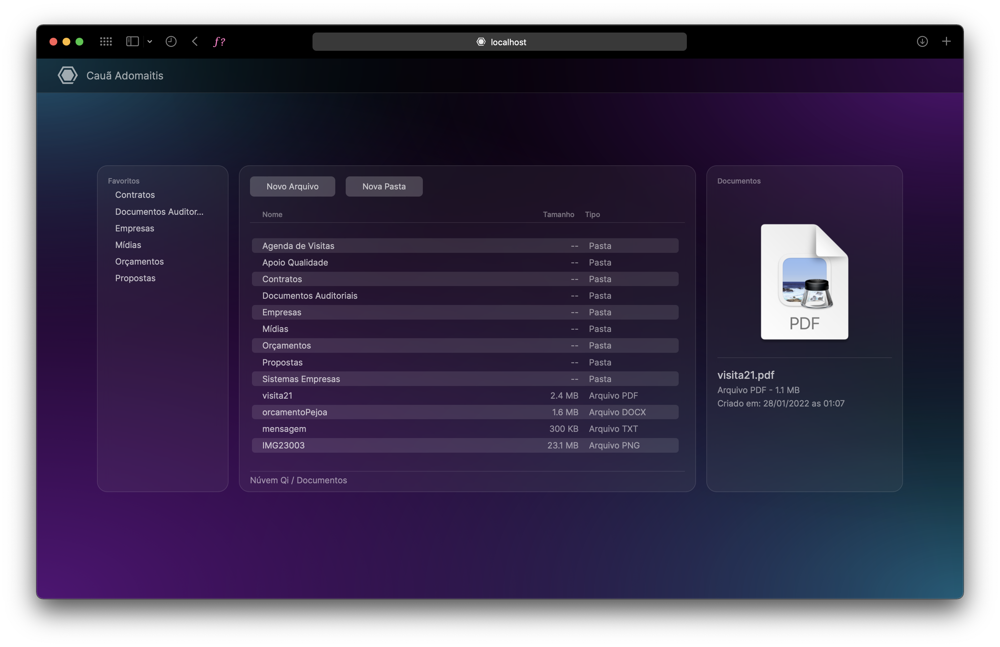

# Núvem Qi (Qi Cloud)

The Qi Cloud is an online storage system. It serves to provide instantaneous access to Qi's files and documents.

## Technologies Used

- TypeScript
- React
- Pure CSS
- Firebase

## Details

The Qi Cloud has a unique style and usage, being extremely simple and functional.

## Status

The Project is currently in Development.
